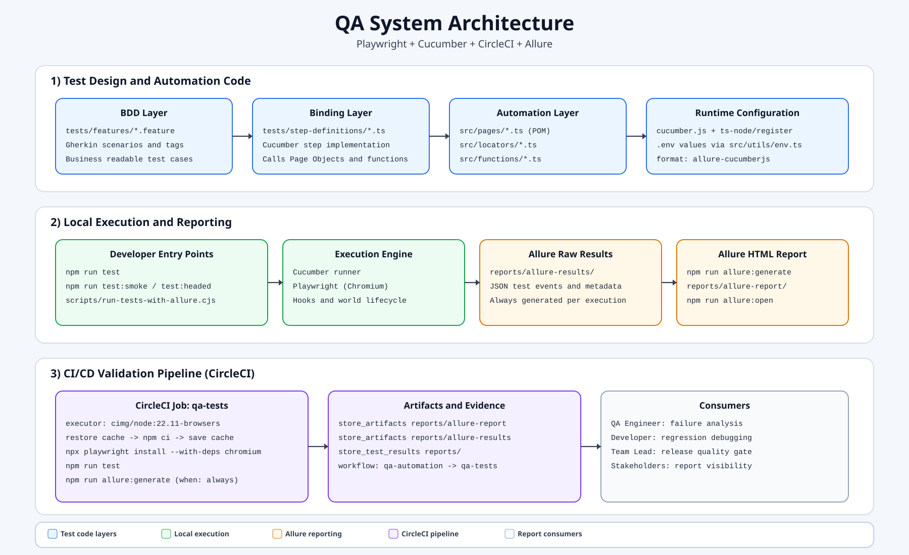
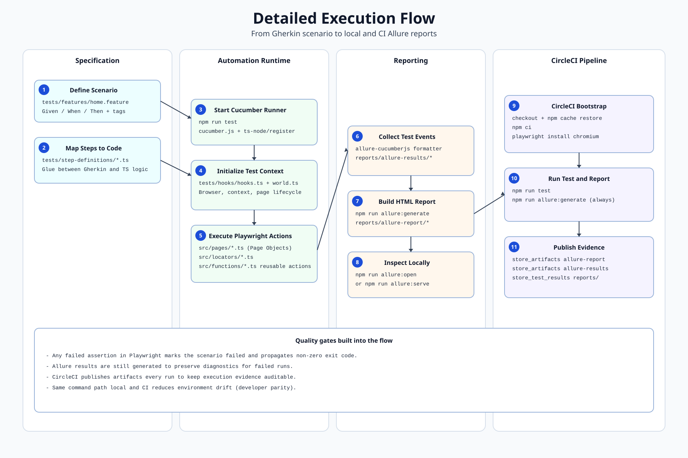
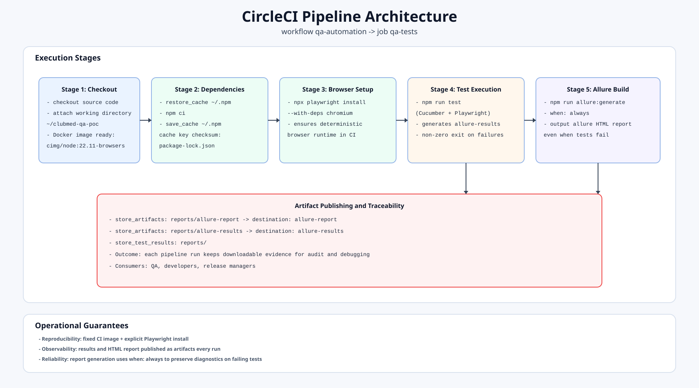

# Club Med App QA POC

Automatisation QA pour la page **My Club Med App** avec Playwright + Cucumber.

## Objectif

Verifier que la page se charge et que les liens App Store / Google Play sont visibles.

## Stack

- `@cucumber/cucumber` pour les scenarios BDD
- `@playwright/test` pour piloter le navigateur
- `allure-cucumberjs` pour le reporting

## Arborescence

```text
src/
  pages/
  functions/
  locators/
  utils/
tests/
  features/
  step-definitions/
  hooks/
cucumber.js
package.json
README.md
```

## Architecture professionnelle

### 1) Vue systeme globale



### 2) Flux d'execution detaille



### 3) Architecture pipeline CircleCI



## Commandes a lancer

### 1) Installation initiale

```powershell
npm install
npx playwright install
```

### 2) Tests

```powershell
# Important: `npm run` tout seul n'execute pas les tests.
# Utiliser une commande cible:

# Tous les tests (mode visible avec navigateur) + generation automatique du rapport Allure
npm run test

# Tests smoke uniquement
npm run test:smoke

# Tests visibles (navigateur ouvert + ralenti + pause finale)
npm run test:headed

# Tests visibles (ralenti moyen)
npm run test:observe

# Tests visibles (ralenti fort + pause finale)
npm run test:observe:slow

# Mode debug Playwright
npm run test:debug
```

Apres chaque commande ci-dessus, le rapport HTML est regenere dans `reports/allure-report/index.html`.

### 3) Qualite code

```powershell
# Lint
npm run lint

# Formatage
npm run format

# Verification TypeScript
npx tsc --noEmit
```

### 4) Rapports Allure

```powershell
# Generer le rapport
npm run allure:generate

# Alias de generation
npm run report

# Ouvrir un rapport deja genere
npm run allure:open

# Generer + servir en local
npm run allure:serve
```

### 5) Cucumber direct (optionnel)

```powershell
# Filtrer par tag
npx cucumber-js --tags "@download"

# Resume execution
npx cucumber-js --format summary
```

## Variables d'environnement utiles

```powershell
# PowerShell (session courante)
$env:PW_HEADLESS="false"
$env:PW_SLOW_MO="1200"
$env:PW_HOLD_BROWSER_MS="10000"
$env:CUCUMBER_TIMEOUT_MS="30000"
$env:BROWSER="chromium"
```

## Page testee

https://www.clubmed.fr/l/my-club-med-app
